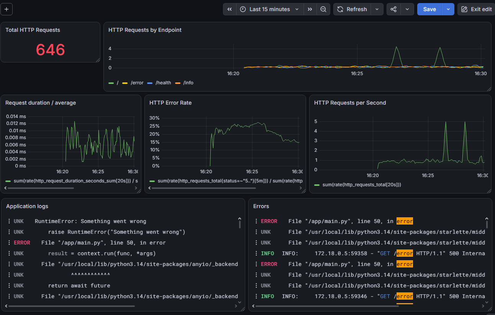

The goal of this challenge was to introduce observability into the web application by collecting and visualizing metrics and logs, and creating alerts based on application behavior.

Metrics provide numerical measurements that are useful for understanding the behavior and health of a system over time, while logs provide detailed event information that can be used to investigate specific situations.

The complete observability stack was deployed using Docker Compose, allowing all components to communicate through the Docker network.

The application now has a basic but complete observability stack capable of collecting:

- HTTP metrics with Prometheus
- Application/container logs with Loki
- Visualizations and dashboards with Grafana
- Alerts with Prometheus and Alertmanager

---

## Metrics with Prometheus and Grafana

The metrics from the FastAPI application were extracted using the `prometheus-fastapi-instrumentator` package.

This instrumentator automatically exposes a `/metrics` endpoint containing Prometheus compatible metrics generated from HTTP requests.

The `/metrics` endpoint itself was excluded from instrumentation so that Prometheus periodic scraping would not artificially increase the application's HTTP request metrics.

Prometheus and Grafana were both deployed as Docker containers.

#### Metrics collected

The instrumentation provides several HTTP related metrics. The Grafana dashboard was configured to visualize the following metrics:

- Total HTTP requests
- HTTP requests by endpoint
- HTTP requests per second
- Average request duration
- HTTP error rate

The dashboard also includes the application's logs, which allows metrics and logs to be inspected from the same interface.

#### Grafana Dashboard

The resulting dashboard provides an overview of the application's HTTP activity.

---

# Application logs with Loki

The application already writes its logs to standard output through Uvicorn. Docker captures this output and makes it available through its container logging system.

Therefore, it was not necessary to modify the application to write logs to files.

#### Implementation

Three components were used:

- **Grafana Alloy**: collects logs from Docker containers.
- **Loki**: stores and indexes the logs.
- **Grafana**: provides the interface for querying and visualizing them.

Alloy uses the Docker API through the Docker socket to discover containers and attaches useful metadata such as the container name and Docker Compose service.

The logs are then forwarded to Loki through its HTTP API.

---

# Alerting with Prometheus and Alertmanager

Prometheus was configured with an alerting rule that monitors the application's HTTP request rate.

The implemented rule triggers when the application receives more than 2 requests per second for at least 5 seconds.

The alert is intentionally configured with a relatively low threshold because the application is being tested locally and the objective is to observe the alerting process.

##### Prometheus and Alertmanager

Prometheus evaluates the alerting rule and sends alerts to Alertmanager.

Alertmanager was included in the Docker Compose stack and configured to receive alerts from Prometheus.

For this challenge, Alertmanager was intentionally kept simple. It is used to demonstrate the alert lifecycle and provide a centralized interface for active alerts, rather than configuring external notification channels.

#### Testing the alert

The alert was tested by generating HTTP traffic against the application.

Once the request rate exceeded the configured threshold, the alert transitioned through the expected states: inactive, pending, firing. 
After the traffic stopped and the request rate returned to normal, the alert eventually returned to inactive.

The alert was also visible through the Alertmanager interface.